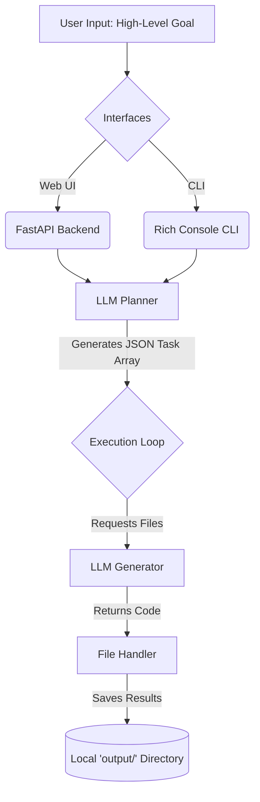

# 🤖 Autonomous Task AI Agent


An advanced, goal-oriented AI engineering agent built in Python. This project takes a high-level goal, breaks it down into logical subtasks, and sequentially executes them while autonomously saving generated code and files directly to your local workspace. Powered by the blistering speed of **LLMs** and state-of-the-art open-source models (like LLaMA 3).

---

## ✨ Key Features

- **🧠 Goal-Oriented Planning:** Deterministically breaks down complex goals into an executable array of architectural tasks.
- **⚡ Lightning Fast Inference:** Integrates with an **LLM API** to utilize models with unparalleled speed.
- **🖥️ Dual Interfaces:** 
  - A beautiful, fully interactive **Web UI** served via **FastAPI**.
  - A stylish **Command-Line Interface (CLI)** utilizing the `rich` library.
- **📂 Automated Local File Generation:** Recognizes generated code blocks natively and outputs tangible files seamlessly into a local `output/` directory (e.g. `index.html`, `script.py`).
- **🔄 Iterative Execution Loop:** Executes granular sub-tasks iteratively, isolating file creation and logic.

---

## 🏗️ Architecture



---

## 📂 Project Structure

- **`backend/`**: Contains the FastAPI server (`app.py`) for the web interface and orchestrator state management.
- **`frontend/`**: Contains the HTML/JS/CSS for the interactive web UI (`index.html`).
- **`agent/`**: Contains the modular core logic for the CLI version (`main.py`, `planner.py`, `executor.py`, `file_handler.py`, etc.).
- **`config.py`**: Centralized configuration management handling environment variables and settings.
- **`requirements.txt`**: Project dependencies including LLM SDKs, FastAPI, and Pydantic.

---

## 🚀 Setup Instructions

1. **Clone the Repository:**
   ```bash
   git clone <your-repo-url>
   cd autonomous_task_agent
   ```

2. **Create a Virtual Environment:**
   ```bash
   python -m venv venv
   
   # On macOS/Linux
   source venv/bin/activate
   
   # On Windows
   venv\Scripts\activate
   ```

3. **Install Dependencies:**
   ```bash
   pip install -r requirements.txt
   ```

4. **Environment Setup:**
   Create a `.env` file in the root directory and insert your **LLM API Key**:
   ```env
   LLM_API_KEY=your_api_key_here
   MODEL_NAME=llama-3.3-70b-versatile
   ```

---

## 💻 Usage

### 1. Web Interface (FastAPI)

Run the backend server:

```bash
python backend/app.py
```
*(Alternatively, you can run: `uvicorn backend.app:app --host 0.0.0.0 --port 8000`)*

Open your browser and navigate to: **`http://localhost:8000`**

### 2. Command-Line Interface (CLI)

Run the main CLI script for an interactive terminal experience:

```bash
python agent/main.py
```

### Sample Run
- **Input Goal**: "Create a personal portfolio website"
- **Planner Output**:
  1. Create `index.html` structure.
  2. Implement `style.css` matching modern aesthetic.
  3. Create `app.js` with smooth scrolling behavior.
- **Execution**: The AI writes the code, and the File Handler seamlessly outputs `index.html`, `style.css`, and `app.js` into an organized `output/<project_name>` folder!

---

## 🔮 Future Roadmap

- **Vector Database Integration**: Add long-term memory via Pinecone or ChromaDB.
- **Human-in-the-Loop Validation**: Allow users to approve logic and architectural decisions mid-execution.
- **Advanced Tools**: Natively integrate Web Searching (SerpAPI), Terminal execution, and Code Linter tools.

---

## 📜 License

Distributed under the MIT License. See `LICENSE` for more information.
