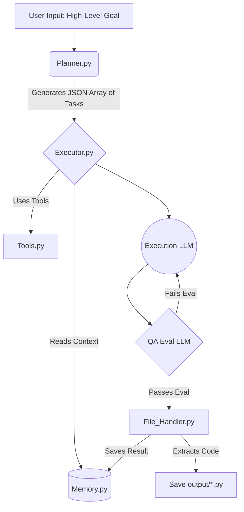

# Autonomous Task AI Agent

An advanced, goal-oriented AI agent built in Python using LangChain and OpenAI. This project takes a high-level goal, breaks it down into logical subtasks, and sequentially executes them while maintaining memory context and autonomously saving code or files to disk.

## Features

- **Goal-Oriented Planning:** Uses Pydantic and GPT-4o-mini structured output to deterministically break down complex goals into an executable array of steps.
- **Context-Aware Execution:** Each task is executed with full knowledge of what was built in prior tasks (Short-Term Memory).
- **Iterative Improvement Loop:** The agent features an internal QA LLM that critiques its own output against expected goals. If it fails, it auto-corrects and retries.
- **Automated File Generation:** Recognizes generated code blocks natively and outputs tangible files seamlessly into an `output/` directory (e.g. `index.html`, `script.py`).
- **Mock Tool Integration:** Integrated support for external tools (e.g. Web Searching) injected neatly into the LLM's context window.

## Architecture



### Module Breakdown

- **`config.py`**: Centralized configuration management handling environment variables and LLM configurations.
- **`agent/planner.py`**: Interacts with the LLM to structure complex goals into step-by-step tasks.
- **`agent/executor.py`**: The main brain that loops over tasks. Implements a reflection loop mapping outputs to expected results.
- **`agent/memory.py`**: Simplistic short-term associative memory mapping task outputs so nothing is forgotten during execution.
- **`agent/tools.py`**: Provides "hooks" for external APIs. Mocks web search but built identically to professional standard agent tool logic.
- **`agent/file_handler.py`**: A robust regex parsing system to pull out clean code from verbose AI outputs.
- **`agent/main.py`**: A beautifully styled CLI utilizing the `rich` library to orchestrate the backend loop.

## Setup Instructions

1. **Clone or Download the Project.**
2. **Create a Virtual Environment:**
   ```bash
   python -m venv venv
   source venv/bin/activate  # On Windows: venv\Scripts\activate
   ```
3. **Install Dependencies:**
   ```bash
   pip install -r requirements.txt
   ```
4. **Environment Setup:**
   Copy `.env.example` to `.env` and insert your API Key.
   ```
   OPENAI_API_KEY=sk-...
   ```

## Usage

Run the main CLI script:

```bash
python agent/main.py
```

### Sample Run

- **Input Goal**: "Create a personal portfolio website"
- **Planner Output**:
  1. Create `index.html` structure.
  2. Implement `style.css` matching modern aesthetic.
  3. Create `app.js` with smooth scrolling behavior.
- **Execution**: The AI writes the code, checks for completeness, and the File Handler outputs `index.html`, `style.css`, and `app.js` into the `output/` folder!

## Future Improvements for Resume
- **Persistent Long-Term Memory (Vector Database)**: Add Pinecone/Chroma integration in `memory.py` for long-running workflows.
- **Human-in-the-Loop**: Implement a user interaction step in `executor.py` so a human can approve changes halfway.
- **More Robust Tools**: Wire SerpAPI natively into the `SearchTool`.
